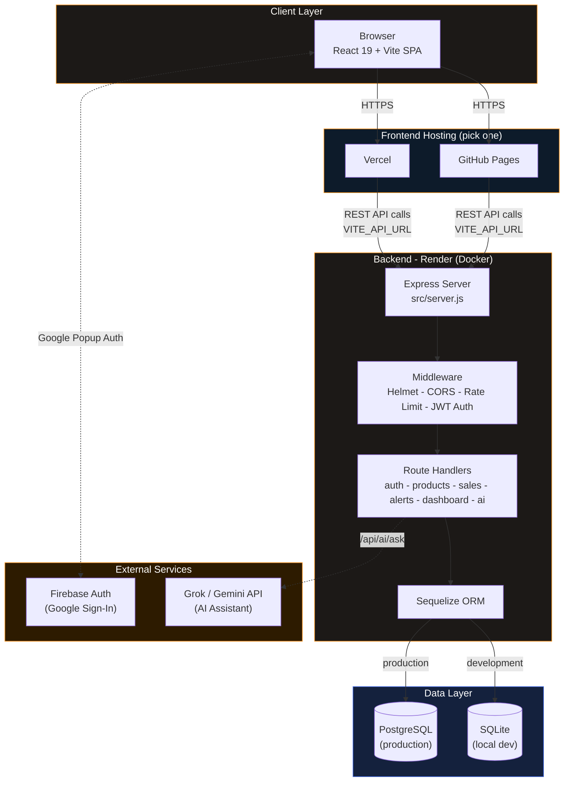
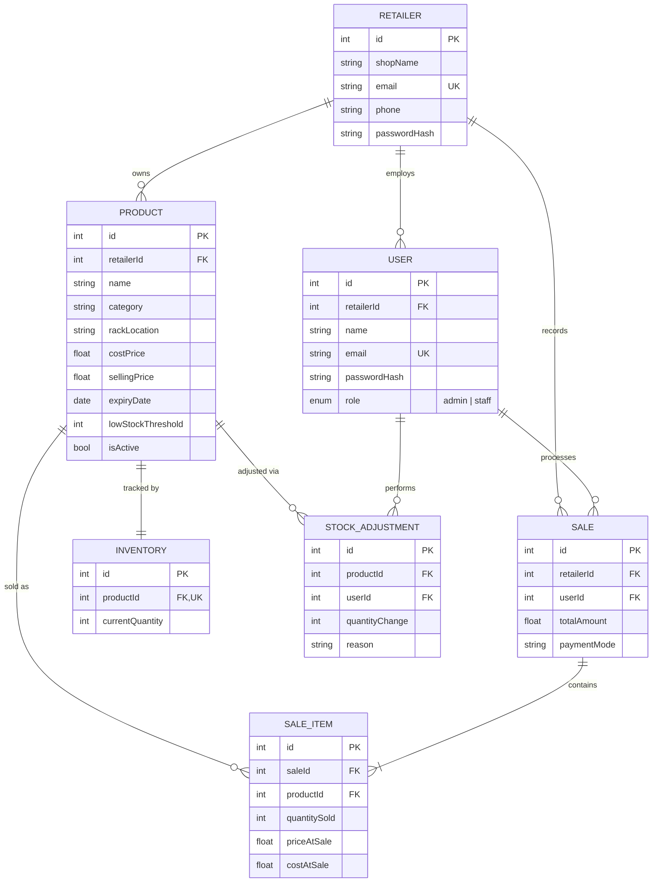
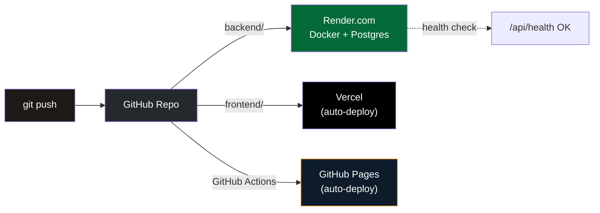

<div align="center">


<br/>

[](https://react.dev)
[](https://www.typescriptlang.org)
[](https://nodejs.org)
[](https://expressjs.com)
[](https://www.postgresql.org)

[](https://vitejs.dev)
[](https://tailwindcss.com)
[](https://sequelize.org)
[](https://www.docker.com)
[](LICENSE)

[](https://github.com/hemnath-kandasamyk/QuantiX/actions/workflows/deploy-pages.yml)


<br/>

**[Live Demo](#-live-deployments)** · **[Report Bug](../../issues)** · **[Request Feature](../../issues)**

</div>

---

## 📖 Table of Contents

- [Overview](#-overview)
- [Features](#-features)
- [Tech Stack](#-tech-stack)
- [System Architecture](#-system-architecture)
- [Database Schema](#-database-schema)
- [Authentication Flow](#-authentication-flow)
- [Project Structure](#-project-structure)
- [API Reference](#-api-reference)
- [Getting Started](#-getting-started)
- [Environment Variables](#-environment-variables)
- [Deployment](#-deployment)
- [Live Deployments](#-live-deployments)
- [Roadmap](#-roadmap)
- [Contributing](#-contributing)
- [License](#-license)
- [Author](#-author)

---

## 🧾 Overview

**QuantiX** is a full-stack shop management platform built for small and mid-sized retailers who need **inventory tracking**, **point-of-sale billing**, and **staff operations** in one clean dashboard — with an AI assistant that actually understands your store's live data.

It's built as a real multi-tenant system: every retailer (shop) gets isolated data, role-based staff accounts, and a JWT-secured API — not a toy demo.

---

## ✨ Features

| | Feature | Description |
|---|---|---|
| 📊 | **Dashboard** | Revenue, transaction count, low-stock overview, 30-day trend chart, top products |
| 🧾 | **Billing (POS)** | Line-item sale builder, tax/discount calculation, instant receipt generation |
| 📦 | **Inventory Management** | Add/edit/delete products, per-product reorder thresholds, bulk stock updates |
| 📈 | **Sales History** | Searchable, filterable transaction log with full receipt detail |
| 🔔 | **Smart Alerts** | Auto-generated low-stock, out-of-stock, and expiry-window alerts |
| 👥 | **Staff Management** | Admin/staff roles, scoped access, staff performance tracking |
| 🤖 | **AI Assistant** | Chat interface with live context on inventory & sales (Grok / Gemini / local fallback) |
| 🔐 | **Authentication** | Email/password + "Continue with Google" (Firebase), both issuing the same JWT |
| 🌗 | **Light/Dark Theme** | Persisted "ledger" aesthetic across sessions |
| ✨ | **Polished UX** | Skeleton loaders, empty states, toasts, animated transitions (Motion) |

---

## 🛠 Tech Stack

<table>
<tr>
<td valign="top" width="50%">

**Frontend**
| Layer | Technology |
|---|---|
| Framework | React 19 + TypeScript |
| Build tool | Vite 6 |
| Styling | Tailwind CSS 4 |
| Routing | React Router 7 |
| Charts | Recharts |
| Icons | Lucide React |
| Animation | Motion (Framer Motion), canvas-confetti |
| HTTP client | Axios |
| Auth (client) | Firebase Authentication |

</td>
<td valign="top" width="50%">

**Backend**
| Layer | Technology |
|---|---|
| Runtime | Node.js 20 |
| Framework | Express 4 |
| ORM | Sequelize 6 |
| Database (dev) | SQLite |
| Database (prod) | PostgreSQL |
| Auth (server) | JWT (jsonwebtoken) + bcrypt |
| Security | Helmet, express-rate-limit, CORS |
| Scheduling | node-cron (alert job) |
| Containerization | Docker |

</td>
</tr>
</table>

---

## 🏗 System Architecture



---

## 🗂 Database Schema



---

## 🔐 Authentication Flow

```mermaid
sequenceDiagram
    actor U as User
    participant F as Frontend (React)
    participant B as Backend (Express)
    participant DB as PostgreSQL
    participant FB as Firebase

    rect rgb(30, 30, 30)
    note over U,DB: Email / Password Login
    U->>F: Enter email + password
    F->>B: POST /api/auth/login
    B->>DB: Find user + verify bcrypt hash
    DB-->>B: User record
    B-->>F: JWT token + user info
    F->>F: Store token in localStorage
    end

    rect rgb(45, 27, 0)
    note over U,FB: Google Sign-In
    U->>F: Click "Continue with Google"
    F->>FB: signInWithPopup()
    FB-->>F: idToken + profile info
    F->>B: POST /api/auth/google
    B->>DB: Find-or-create user + retailer
    DB-->>B: User record
    B-->>F: JWT token + user info
    end

    note over F,B: All subsequent requests
    F->>B: Authorization Bearer token
    B->>B: Verify JWT (middleware)
    B-->>F: Protected resource
```



---

## 📁 Project Structure

```
QuantiX/
├── .github/workflows/       # CI/CD - auto-deploy frontend to GitHub Pages
├── DEPLOYMENT.md            # Full deployment runbook (Render + Vercel + Docker)
├── docker-compose.yml       # Local full-stack orchestration (Postgres + API + SPA)
│
├── backend/
│   ├── Dockerfile
│   ├── database/
│   │   ├── config/config.js    # Sequelize CLI + runtime DB config (SQLite <-> Postgres)
│   │   └── migrations/         # Versioned schema history
│   └── src/
│       ├── server.js           # App entrypoint - security, CORS, routes
│       ├── config/database.js
│       ├── middleware/auth.js  # JWT verification + role guard
│       ├── models/             # Sequelize models (see ER diagram above)
│       ├── routes/
│       │   ├── auth.js         # Register, login, staff CRUD, Google auth, logout
│       │   ├── products.js     # Catalog CRUD + bulk stock updates
│       │   ├── sales.js        # POS checkout + sales log
│       │   ├── alerts.js       # Live low-stock / expiry computation
│       │   ├── dashboard.js    # Aggregated + granular analytics endpoints
│       │   └── ai.js           # AI assistant (Grok -> Gemini -> local fallback)
│       └── utils/
│           ├── alertJob.js     # Scheduled alert checks (node-cron)
│           └── seed.js         # Demo data seeder
│
└── frontend/
    ├── vite.config.ts          # Dev proxy to backend + GH Pages base path
    ├── vercel.json              # SPA rewrite rules for Vercel
    └── src/
        ├── api/client.ts       # Axios instance - JWT header, 401 handling
        ├── components/         # Layout, ProtectedRoute, Toast, Skeleton, etc.
        ├── context/AuthContext.tsx
        ├── lib/firebase.ts     # Firebase client config
        ├── pages/              # Dashboard, Billing, Products, SalesHistory,
        │                       # Alerts, Staff, AIAssistant, Login, Register
        └── App.tsx             # Route definitions
```

---

## 🔌 API Reference

<details>
<summary><strong>🔐 Auth Routes — <code>/api/auth</code></strong></summary>

| Method | Endpoint | Auth | Description |
|---|---|---|---|
| `POST` | `/register-shop` | Public | Register a new shop + owner account |
| `POST` | `/login` | Public | Email/password login |
| `POST` | `/google` | Public | Firebase Google sign-in (find-or-create) |
| `POST` | `/logout` | 🔒 | Session logout |
| `GET` | `/me` | 🔒 | Get current authenticated user |
| `POST` | `/staff` | 🔒 Admin | Create a staff account |
| `GET` | `/staff` | 🔒 Admin | List staff accounts |
| `DELETE` | `/staff/:id` | 🔒 Admin | Remove a staff account |

</details>

<details>
<summary><strong>📦 Product Routes — <code>/api/products</code></strong></summary>

| Method | Endpoint | Auth | Description |
|---|---|---|---|
| `GET` | `/?search=&category=` | 🔒 | Search/list active products |
| `GET` | `/:id` | 🔒 | Get single product |
| `POST` | `/` | 🔒 Admin | Create product |
| `PUT` | `/:id` | 🔒 Admin | Update product |
| `DELETE` | `/:id` | 🔒 Admin | Soft-delete product |
| `POST` | `/:id/adjust` | 🔒 Admin | Manual stock correction (logged) |
| `PATCH` | `/bulk` | 🔒 Admin | Apply stock change to multiple products |

</details>

<details>
<summary><strong>💳 Sales, 🔔 Alerts & 📊 Dashboard</strong></summary>

| Method | Endpoint | Auth | Description |
|---|---|---|---|
| `POST` | `/api/sales` | 🔒 | Record a new sale |
| `GET` | `/api/sales` | 🔒 | Sales history |
| `GET` | `/api/alerts` | 🔒 | Low-stock / expiring / out-of-stock alerts |
| `POST` | `/api/alerts/read-all` | 🔒 | Acknowledge all alerts |
| `DELETE` | `/api/alerts/:id` | 🔒 | Dismiss a single alert |
| `GET` | `/api/dashboard` | 🔒 | Combined dashboard payload |
| `GET` | `/api/dashboard/summary` | 🔒 | Today/month/year rollups |
| `GET` | `/api/dashboard/trend` | 🔒 | Daily revenue series |
| `GET` | `/api/dashboard/staff-performance` | 🔒 | Sales grouped by staff |
| `POST` | `/api/ai/ask` | 🔒 | Ask the AI assistant a question |
| `GET` | `/api/health` | Public | Service + DB health check |

</details>

---

## 🚀 Getting Started

### Prerequisites
- Node.js **20+**
- npm
- (optional) Docker, if you'd rather run everything with `docker compose`

### 1. Clone the repo

```bash
git clone https://github.com/hemnath-kandasamyk/QuantiX.git
cd QuantiX
```

### 2. Backend setup

```bash
cd backend
npm install
cp .env.example .env      # fill in JWT_SECRET at minimum
npm run db:migrate        # creates local SQLite schema
npm run seed               # optional demo data
npm run dev                 # http://localhost:4000
```

### 3. Frontend setup

```bash
cd frontend
npm install
cp .env.example .env.local
npm run dev                 # http://localhost:3000
```

The Vite dev server proxies `/api/*` straight to your local backend — no CORS setup needed locally.

### 4. Or run everything with Docker

```bash
docker compose up --build
```

---

## 🔑 Environment Variables

<table>
<tr>
<td valign="top" width="50%">

**Backend (`backend/.env`)**
| Variable | Required | Purpose |
|---|---|---|
| `NODE_ENV` | ✅ | `development` or `production` |
| `JWT_SECRET` | ✅ (prod) | Signs auth tokens |
| `DATABASE_URL` | ✅ (prod) | Postgres connection string |
| `FRONTEND_URL` | ✅ (prod) | Comma-separated CORS allow-list |
| `GEMINI_API_KEY` | Optional | Powers AI Assistant fallback |
| `XAI_API_KEY` | Optional | Grok, tried before Gemini |

</td>
<td valign="top" width="50%">

**Frontend (`frontend/.env.local`)**
| Variable | Required | Purpose |
|---|---|---|
| `VITE_API_URL` | ✅ (prod) | Deployed backend base URL |
| `VITE_API_PROXY_TARGET` | Local dev only | Where `/api` proxies to |
| `VITE_FIREBASE_API_KEY` | For Google sign-in | Firebase config |
| `VITE_FIREBASE_AUTH_DOMAIN` | For Google sign-in | Firebase config |
| `VITE_FIREBASE_PROJECT_ID` | For Google sign-in | Firebase config |
| `VITE_FIREBASE_APP_ID` | For Google sign-in | Firebase config |

</td>
</tr>
</table>

---

## 📡 Deployment

QuantiX is designed so the **backend and frontend deploy independently** — mix and match platforms freely.



Full step-by-step instructions (Render, Vercel, GitHub Pages, and self-hosted Docker) live in **[`DEPLOYMENT.md`](DEPLOYMENT.md)**.

**Post-deploy checklist:**
- [ ] `/api/health` returns `{"status":"healthy","database":"connected"}`
- [ ] Frontend network requests hit the deployed backend, not `localhost`
- [ ] `FRONTEND_URL` on the backend matches every deployed frontend origin (CORS)
- [ ] `JWT_SECRET` is a real random value, not a placeholder
- [ ] `.env` and `.sqlite` files are gitignored, never committed

---

## 🌍 Live Deployments

| Environment | URL | Status |
|---|---|---|
| Backend API | `https://quantix-1.onrender.com` |  |
| Frontend (Vercel) | `https://quanti-x.vercel.app` |  |
| Frontend (GitHub Pages) | `https://hemnath-kandasamyk.github.io/QuantiX` |  |

> ⚠️ Free-tier backend note: Render's free instance spins down after inactivity — the first request after idle time can take 30–50s to wake up.

---

## 🗺 Roadmap

- [ ] Server-side verification of Firebase ID tokens (currently trusted client-side)
- [ ] Persist alert "read/dismissed" state (currently computed live, no `AlertRead` table yet)
- [ ] Add `receiptNo`, `customerName`, `paymentMethod`, and product `unit`/`SKU` columns
- [ ] Multi-location inventory support
- [ ] Automated test coverage expansion (Jest + Supertest scaffolding already in place)
- [ ] Rate-limit and audit-log admin actions

---

## 🤝 Contributing

Contributions, issues, and feature requests are welcome!

```bash
1. Fork the repo
2. Create your branch:   git checkout -b feature/amazing-feature
3. Commit your changes:  git commit -m "Add amazing feature"
4. Push to the branch:   git push origin feature/amazing-feature
5. Open a Pull Request
```

---

## 📄 License

Distributed under the **MIT License**. See [`LICENSE`](LICENSE) for details.

---

## 👤 Author

<div align="center">

**Hemnath KK**

Final-year B.Tech, Artificial Intelligence & Data Science
V.S.B. Engineering College, Karur, Tamil Nadu

[](https://github.com/hemnath-kandasamyk)

<br/>


</div>
